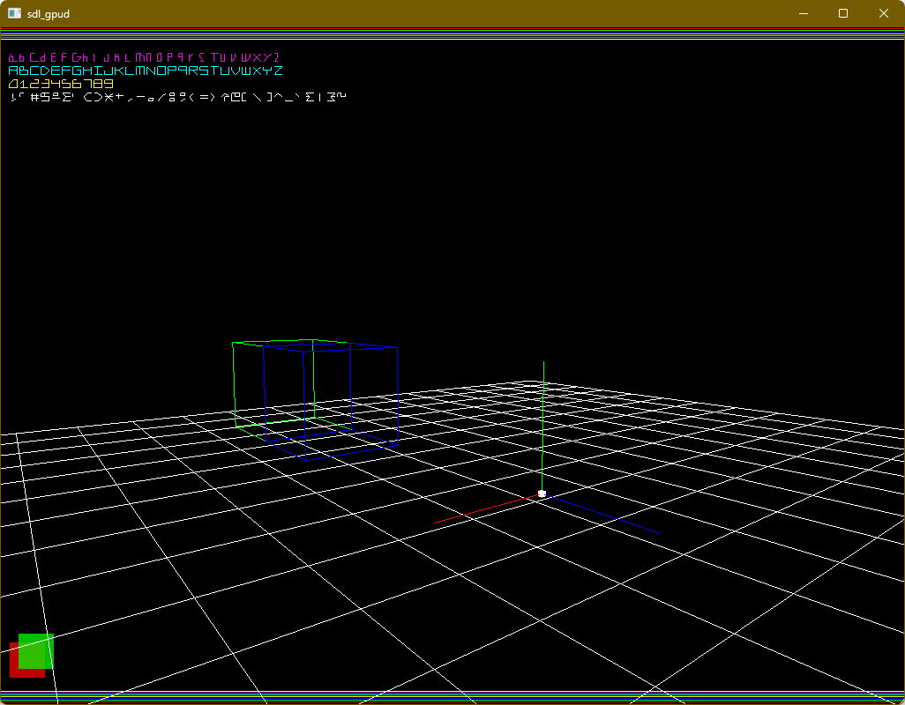

# SDL GPUD

A header-only immediate-mode debug drawing API for SDL3 GPU



### Features
- Vulkan, Direct3D12 and Metal support
- 2D and 3D primitives
- 2D text rendering
- And more soon...

### Using SDL GPUD

SDL GPUD consists of two headers:
- `SDL_gpud.h` (Implementation)
- `SDL_gpud_shaders.h` (Precompiled SPV, DXIL, and MSL shaders)

To use SDL GPUD, copy these two headers into your project and in **one C** file add:
```c
#define SDL_GPUD_IMPL
#include "SDL_gpud.h"
```

See the following for a basic example (or [main.cpp](example/main.cpp)):
```c++
if (!SDL_InitGPUD(/* ... */)) {
    /* Handle errors */
}

while (true) {
    /* Acquire command buffer and swapchain texture */
    /* Do regular drawing... */

    SDL_SetGPUDColor({1.0f, 0.0f, 0.0f, 1.0f});
    SDL_DrawGPUDLine({0.0f, 0.0f, 0.0f}, {0.0f, 0.0f, 100.0f});
    SDL_SetGPUDColor({0.0f, 1.0f, 0.0f, 1.0f});
    SDL_DrawGPUDLine({0.0f, 0.0f, 0.0f}, {0.0f, 100.0f, 0.0f});
    SDL_SetGPUDColor({0.0f, 0.0f, 1.0f, 1.0f});
    SDL_DrawGPUDLine({0.0f, 0.0f, 0.0f}, {100.0f, 0.0f, 0.0f});

    /* Submit draw commands */
    SDL_SubmitGPUD(/* ... */);
    SDL_SubmitGPUCommandBuffer(/* ... */);
}

SDL_QuitGPUD();
```